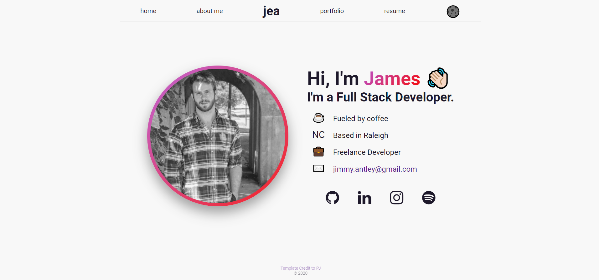
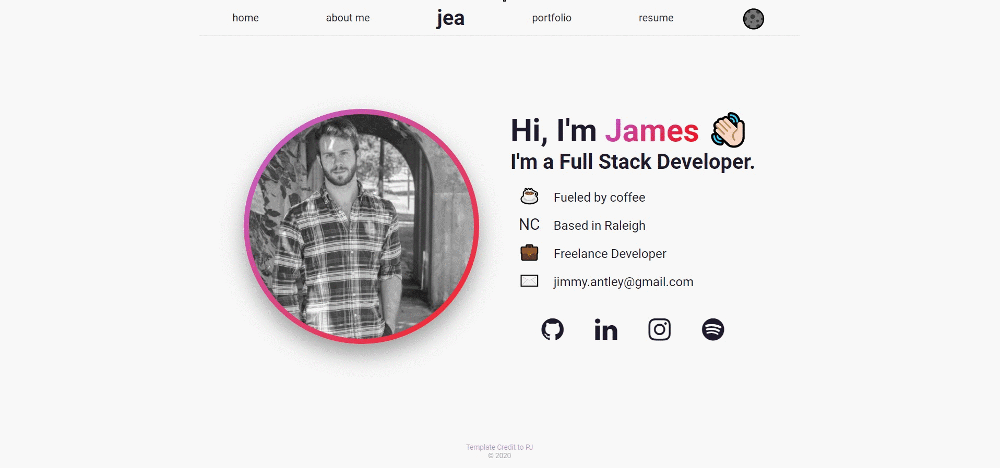
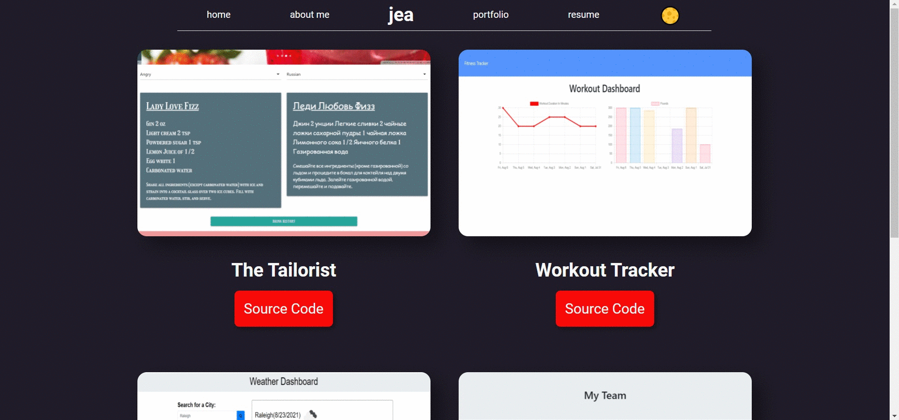

# React Portfolio
  
## Description
A fully responsive professional portfolio built with React and using SCSS styling technologies to develop a cleaner, smoother page for all up-to-date projects. Features include: A Dark Mode Toggler, A Multi-Page Layout with a static Navbar, and SCSS styling modules.
## Table of Contents
* [Live Link](##-link)
* [Demo](##-demo)
* [Questions](##-questions)

## Link
<a href="https://jimmant91.github.io/React_Portfolio/#/">Deployed Page</a>

## Demo

## Questions
If you have any questions about the repo, open an issue or contact me directly at [jimmy.antley@gmail.com](mailto:jimmy.antley@gmail.com). You can find more of my work at [Jimmant91](https://www.github.com/Jimmant91).

